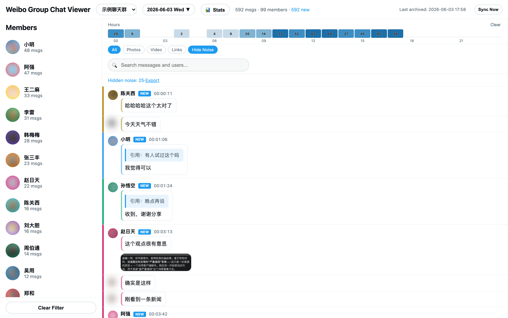
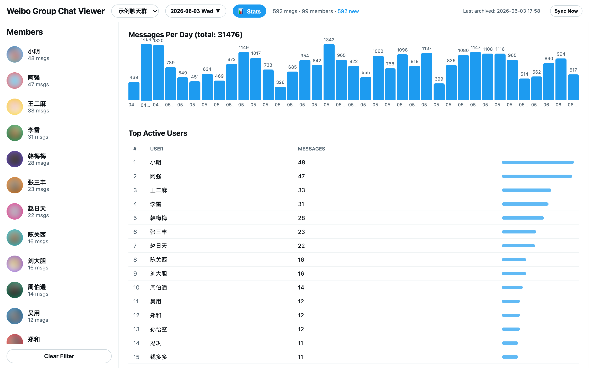

# 📨 Weibo Group Chat Archiver

> 自动抓取微博网页聊天群的历史消息 — 支持多群、定时归档、按天导出，以及一个功能完整的本地可视化查看器。

<p>
  
  
  
  
</p>

---

## ✨ 功能

| 归档 | 查看器 |
| --- | --- |
| 🗂 多群支持（`config.json` 配置） | 🔀 多群切换 |
| 🍪 Cookie 自动保持登录 | 📅 日历选择 + 60s 自动刷新 |
| 📡 API 分页拉取全部历史 | 🔥 时段热力图 / 用户 / 媒体筛选 |
| ➕ 增量归档（断点续传） | 🔍 全文搜索（内容 + 用户名，高亮） |
| 📆 按日期导出 JSON | 📊 统计面板（日活 / 排行 / 时段 / 词频） |
| ⏰ 定时任务 + 手动 Sync Now | 🧹 红包 / 噪声消息过滤 |
| | 🖼 图片代理（绕过防盗链）、视频链接 |
| | 💬 分享卡片、转发引用、头像、Emoji |

---

## 📸 预览

**消息视图** — 时段热力图、用户侧栏、引用气泡、噪声过滤



**统计面板** — 每日消息量、活跃用户排行



> 截图中的用户名、群名与头像均为脱敏示例。

---

## 🚀 快速开始

```bash
git clone https://github.com/alloevil/weibo-chat-auto.git
cd weibo-chat-auto
npm install
```

然后按下面四步走 👇

### 1️⃣ 保存 Cookie（首次）

```bash
npm run save-cookies
```

会弹出一个**独立浏览器窗口**（与日常 Chrome 隔离），打开微博聊天页：

1. 用微博 App 扫码
2. 手机确认登录
3. 跳转到聊天列表后，Cookie 自动写入 `cookies.json`，窗口关闭

> 💡 归档器通过 Puppeteer 启动的独立浏览器不共享日常 Chrome 的登录态，所以需要单独扫码一次。

### 2️⃣ 配置群聊

编辑 `config.json`，群名须与微博中**完全一致**：

```json
{
    "chromePath": "/Applications/Google Chrome.app/Contents/MacOS/Google Chrome",
    "groups": ["群名称A", "群名称B"]
}
```

### 3️⃣ 运行归档

```bash
npm run archive
```

首次拉取最近 7 天，之后每次增量更新。

### 4️⃣ 查看数据

```bash
npm run view
```

打开 **http://localhost:3456** ，右上角 **Sync Now** 可随时手动同步。

---

## 🔁 日常使用

平时保持查看器开着即可：

```bash
npm run view
```

打开 http://localhost:3456 → 点 **Sync Now** 同步最新消息（页面每 60s 自动刷新）。

### 🍪 Cookie 维护

Cookie 有时效（约几天～两周），但**归档器每次成功运行都会自动续期**，因此：

| 方式 | 效果 |
| --- | --- |
| ✅ 保持定时任务运行 | Cookie 自动续期，基本不会过期（推荐） |
| 🖱 每天点一次 Sync Now | 手动保活 |
| 🔄 `npm run save-cookies` | 已过期时重新扫码（不影响已归档数据） |

---

## ⏰ 定时自动运行（可选）

```bash
./setup.sh
```

或手动管理 launchd 任务：

```bash
launchctl load   ~/Library/LaunchAgents/com.allo.weibo-chat-archive.plist  # 启用
launchctl list | grep weibo                                                # 查看状态
launchctl unload ~/Library/LaunchAgents/com.allo.weibo-chat-archive.plist  # 停用
```

---

## 📁 项目结构

```text
weibo-chat-auto/
├── config.json              # 群聊配置 + Chrome 路径
├── auto-archive-simple.js   # 主归档脚本
├── save-cookies.js          # Cookie 保存工具
├── viewer-server.js         # 本地查看器服务器
├── viewer.html              # 查看器页面（单页应用）
├── cookies.json             # 登录凭据（不提交）
├── state/                   # 归档状态（不提交）
├── output/                  # 归档数据（不提交）
│   └── 群名/
│       └── weibo_chat_2026-05-01.json
├── cache/images/            # 图片缓存（不提交）
├── com.allo.weibo-chat-archive.plist   # 定时任务配置
└── package.json
```

---

## 🧾 输出数据格式

每条消息：

```json
{
    "id": 123456789,
    "from_uid": 12345,
    "user": "用户名",
    "avatar": "https://...",
    "timestamp": 1778000000000,
    "time": "2026/05/11 12:00:00",
    "date": "2026-05-11",
    "content": "消息内容",
    "type": 321,
    "pics": ["https://upload.api.weibo.com/2/mss/msget?source=209678993&fid=..."],
    "share": {
        "url": "http://weibo.com/...",
        "title": "...",
        "author": "...",
        "pics": ["https://wx1.sinaimg.cn/large/..."],
        "reposts": 100,
        "comments": 50,
        "likes": 200
    }
}
```

---

## 🛠 故障排除

<details>
<summary><b>Cookie 失效</b>（同步报错、日历不更新、日志出现"未找到群聊"）</summary>

```bash
npm run save-cookies
```

扫码登录后 Cookie 自动保存。

**为什么过期？** 独立浏览器不共享日常登录态，微博 Cookie 本身有时效。长期不运行归档（如定时任务被停用）就会过期。保持定时任务运行可自动续期。
</details>

<details>
<summary><b>页面加载失败</b></summary>

检查 `config.json` 中的 `chromePath` 是否正确，并确认已安装 Google Chrome。
</details>

<details>
<summary><b>图片不显示</b></summary>

图片经本地服务器代理加载（依赖有效 Cookie），Cookie 过期后无法显示。重新 `npm run save-cookies` 即可。
</details>

---

## 🔒 隐私声明

> **本工具仅供归档自己参与的群聊消息，请勿用于侵犯他人隐私。**

- 归档数据包含群内所有成员的消息内容、用户名和头像
- 请妥善保管 `cookies.json` 和 `output/`，切勿公开分享
- 代码仅供学习交流，使用者自行承担风险
- 请遵守微博服务条款和相关法律法规

---

## 📄 License

[MIT](LICENSE)
