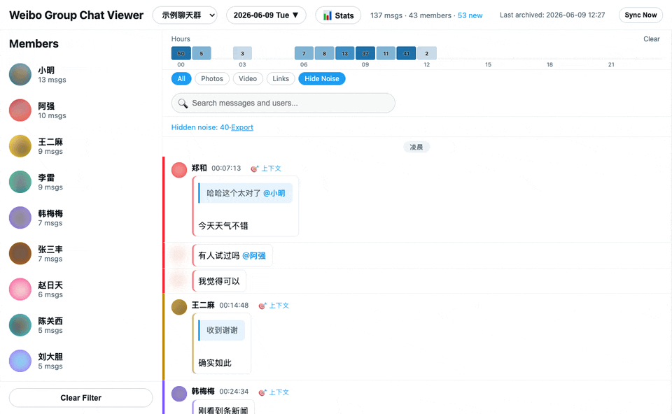
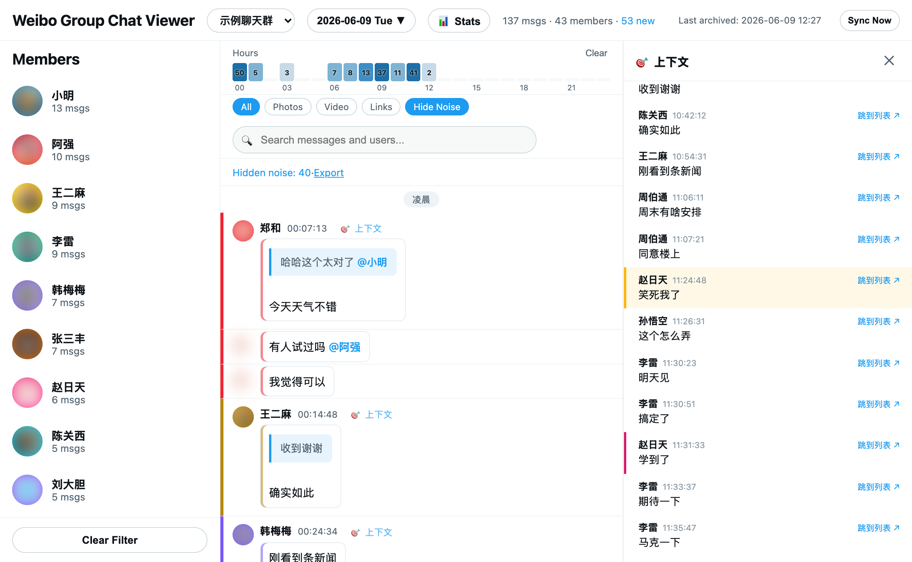

# 📨 Weibo Group Chat Archiver

> 自动抓取微博网页聊天群的历史消息 — 支持多群、定时归档、按天导出，以及一个功能完整的本地可视化查看器。

<p>
  
  
  
  
</p>



> 演示中的用户名、群名与头像均为脱敏示例。

---

## ✨ 功能

| 归档 | 查看器 |
| --- | --- |
| 🗂 多群支持（`config.json` 配置） | 🔀 多群切换 |
| 🍪 Cookie 自动保持登录 | 📅 日历选择 + 60s 自动刷新 |
| 📡 API 分页拉取全部历史 | 🔥 时段热力图 / 用户 / 媒体筛选 |
| ➕ 增量归档（断点续传） | 🔍 搜索就地高亮 + n/N 跳转（保留上下文） |
| 📆 按日期导出 JSON | 📊 统计面板（日活 / 排行 / 时段 / 词频） |
| ⏰ 定时任务 + 手动 Sync Now | 🧹 红包 / 噪声消息过滤 |
| | 🎯 上下文聚焦面板（追一条消息的来龙去脉） |
| | 💬 引用可跳转、标注原作者；@提及高亮 |
| | 🤖 AI 每日摘要 + Agentic Q&A 问答 |
| | 🖼 图片代理（绕过防盗链）、视频链接、分享卡片 |

---

## 🚀 快速开始

### 一键安装（推荐）

```bash
git clone https://github.com/alloevil/weibo-chat-auto.git
cd weibo-chat-auto
./setup.sh
```

`setup.sh` 会引导你完成全部步骤：检查 Node → 安装依赖 → 配置群聊 → 扫码登录 → 询问是否启用定时任务。脚本可重复运行，已配置的步骤会自动跳过。

装完后：

```bash
npm run archive   # 手动归档一次
npm run view      # 启动查看器 → http://localhost:3456
```

<details>
<summary><b>手动安装（分步说明）</b></summary>

#### 1️⃣ 安装依赖

```bash
npm install
```

#### 2️⃣ 保存 Cookie

```bash
npm run save-cookies
```

会弹出一个**独立浏览器窗口**（与日常 Chrome 隔离），打开微博聊天页：用微博 App 扫码 → 手机确认 → 跳转到聊天列表后 Cookie 自动写入 `cookies.json`。

#### 3️⃣ 配置群聊

复制模板并填入群名（须与微博中**完全一致**）：

```bash
cp config.example.json config.json
```

```json
{
    "chromePath": "",
    "groups": ["群名称A", "群名称B"]
}
```

> `chromePath` 留空即自动探测系统中的 Chrome；仅在 Chrome 装在非默认位置时才需手动填写。

#### 4️⃣ 运行 & 查看

```bash
npm run archive   # 首次拉取最近 7 天，之后增量更新
npm run view      # 启动查看器 → http://localhost:3456
```

</details>

---

## 🔁 日常使用

平时保持查看器开着即可：

```bash
npm run view
```

打开 http://localhost:3456 → 点 **Sync Now** 同步最新消息（页面每 60s 自动刷新）。

<details>
<summary><b>读记录小技巧</b></summary>

- **🎯 上下文**：每条消息头部的链接，点开右侧面板看它的来龙去脉（被回复的原消息 + 前后邻域 + 后续回复）
- **引用跳转**：引用气泡标出原作者，点击可跳到原消息并高亮
- **搜索定位**：搜索不隐藏其它消息，就地高亮匹配，用 `n` / `N` 在结果间跳转
- **未读分隔线**：再次打开时，「以下为新消息」标出上次离开后的增量

</details>

<details>
<summary><b>Cookie 维护</b></summary>

Cookie 有时效（约几天～两周），但**归档器每次成功运行都会自动续期**：

| 方式 | 效果 |
| --- | --- |
| ✅ 保持定时任务运行 | Cookie 自动续期，基本不会过期（推荐） |
| 🖱 每天点一次 Sync Now | 手动保活 |
| 🔄 `npm run save-cookies` | 已过期时重新扫码（不影响已归档数据） |

</details>

---

## 🤖 AI 功能

查看器内置两个 AI 功能：**每日摘要** 和 **Agentic Q&A 问答**。需配置 OpenAI 兼容的 API。

### 配置

页面右上角 ⚙️ → 填写：

| 字段 | 说明 |
|------|------|
| Base URL | API 地址（如 `https://api.deepseek.com/v1`） |
| API Key | 密钥 |
| Model | 模型名（如 `deepseek-chat`） |
| Vision | 摘要时是否分析图片 |

配置保存到本地 `ai-config.json`（不会提交到 git）。

### Q&A 问答

在工具栏的问答输入框中提问，支持自然语言时间（"最近"、"昨天"、"上周"）和人名筛选。

**Agent 模式**（默认）：LLM 迭代搜索，自主决定关键词和搜索范围，多轮查找直到信息充分。

<details>
<summary><b>技术方案</b></summary>

采用 Agentic Search 模式，loop 机制参考：
- [Hermes Agent](https://github.com/NousResearch/hermes-agent) — IterationBudget + grace call
- [Pi-Multi-Agent](https://github.com/jwangkun/Pi-Multi-Agent) — state machine + retry with backoff + timeout
- LedgerAgent 论文 — 结构化状态累积

详见 [`docs/agent-qa.md`](docs/agent-qa.md)

**Benchmark (Agent vs Legacy):**

| 指标 | Agent | Legacy |
|------|-------|--------|
| 平均延迟 | 20.5s | 10.1s |
| 成功率 | 100% | 100% |
| 日期推理 | 正确 | 偶尔错误 |
| 搜索覆盖 | 多轮扩展 | 单次 |
| 答案质量 | 高 | 中 |

</details>

---

<details>
<summary><b>📸 预览截图</b></summary>

**消息视图** — 时段热力图、引用气泡（标原作者）、@提及高亮、每条「🎯 上下文」入口


**上下文聚焦** — 点 🎯 弹出右侧面板：被回复的原消息 + 前后邻域 + 后续回复



**统计面板** — 每日消息量、活跃用户排行


> 截图中的用户名、群名与头像均为脱敏示例。

</details>

<details>
<summary><b>✅ 前置要求</b></summary>

| 必需 | 说明 |
| --- | --- |
| 🖥 **macOS / Linux / WSL** | 归档与查看器跨平台运行；定时任务自动安装仅 macOS（Linux 见 cron 说明） |
| 🟢 **Node.js 18+** | [brew install node](https://brew.sh)（macOS）/ `apt install nodejs`（Linux）/ [nodejs.org](https://nodejs.org) |
| 🌐 **Google Chrome** | 归档器用它登录并抓取消息；路径自动探测 |
| 📱 **微博账号 + 手机 App** | 首次需用 App 扫码登录网页版 |

> Windows 用户请在 [WSL](https://learn.microsoft.com/windows/wsl/install) 中使用。

</details>

<details>
<summary><b>⏰ 定时自动运行</b></summary>

**macOS** — `./setup.sh` 安装时会询问是否启用，也可手动管理 launchd 任务：

```bash
launchctl list | grep weibo                                                # 查看状态
launchctl unload ~/Library/LaunchAgents/com.allo.weibo-chat-archive.plist  # 停用
launchctl load   ~/Library/LaunchAgents/com.allo.weibo-chat-archive.plist  # 启用
```

**Linux / WSL** — 用 cron（`crontab -e`），每小时归档一次：

```bash
0 * * * * cd /path/to/weibo-chat-auto && node auto-archive-simple.js >> logs/archive.log 2>&1
```

> 启用后定时归档会顺带刷新 Cookie，基本不会过期。

</details>

<details>
<summary><b>📁 项目结构</b></summary>

```text
weibo-chat-auto/
├── setup.sh                 # 一键安装脚本
├── config.example.json      # 群聊配置模板
├── config.json              # 实际配置（不提交）
├── auto-archive-simple.js   # 主归档脚本
├── save-cookies.js          # Cookie 保存工具
├── viewer-server.js         # 本地查看器服务器
├── viewer.html              # 查看器页面（单页应用）
├── qa-agent.mjs             # Agentic Q&A 模块
├── benchmark-qa.mjs         # Agent vs Legacy 对比测试
├── cookies.json             # 登录凭据（不提交）
├── ai-config.json           # AI 配置（不提交）
├── state/                   # 归档状态（不提交）
├── output/                  # 归档数据（不提交）
│   └── 群名/
│       └── weibo_chat_2026-05-01.json
├── cache/images/            # 图片缓存（不提交）
├── docs/                    # 文档和截图
│   └── agent-qa.md          # Agent Q&A 技术方案
└── package.json
```

</details>

<details>
<summary><b>🧾 输出数据格式</b></summary>

每条消息：

```json
{
    "id": 123456789,
    "from_uid": 12345,
    "user": "用户名",
    "avatar": "https://...",
    "timestamp": 1778000000000,
    "time": "2026/05/11 12:00:00",
    "date": "2026-05-11",
    "content": "消息内容",
    "type": 321,
    "pics": ["https://upload.api.weibo.com/2/mss/msget?source=...&fid=..."],
    "share": {
        "url": "http://weibo.com/...",
        "title": "...",
        "author": "...",
        "pics": ["https://wx1.sinaimg.cn/large/..."],
        "reposts": 100,
        "comments": 50,
        "likes": 200
    }
}
```

</details>

---

## 🛠 故障排除

<details>
<summary><b>Cookie 失效</b>（同步报错、日历不更新、日志出现"未找到群聊"）</summary>

```bash
npm run save-cookies
```

扫码登录后 Cookie 自动保存。

**为什么过期？** 独立浏览器不共享日常登录态，微博 Cookie 本身有时效。长期不运行归档（如定时任务被停用）就会过期。保持定时任务运行可自动续期。
</details>

<details>
<summary><b>页面加载失败</b></summary>

检查 `config.json` 中的 `chromePath` 是否正确，并确认已安装 Google Chrome。
</details>

<details>
<summary><b>图片不显示</b></summary>

图片经本地服务器代理加载（依赖有效 Cookie），Cookie 过期后无法显示。重新 `npm run save-cookies` 即可。
</details>

---

## 🔒 隐私声明

> **本工具仅供归档自己参与的群聊消息，请勿用于侵犯他人隐私。**

- 归档数据包含群内所有成员的消息内容、用户名和头像
- 请妥善保管 `cookies.json` 和 `output/`，切勿公开分享
- 代码仅供学习交流，使用者自行承担风险
- 请遵守微博服务条款和相关法律法规

---

## 📄 License

[MIT](LICENSE)
