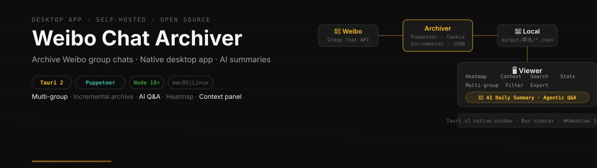
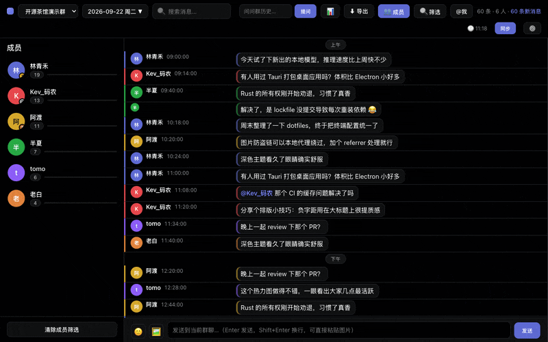
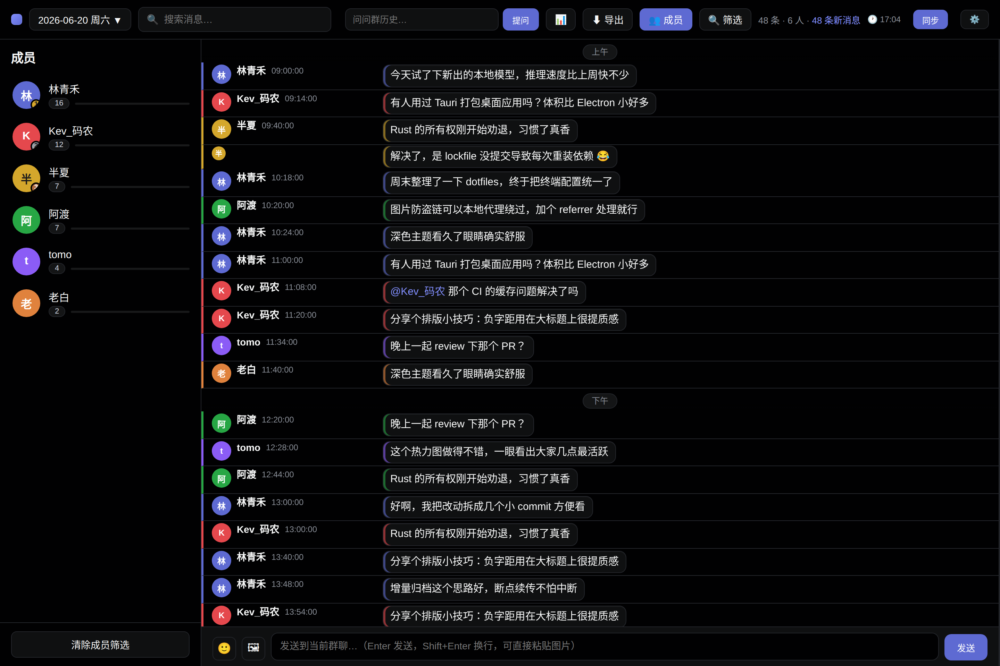
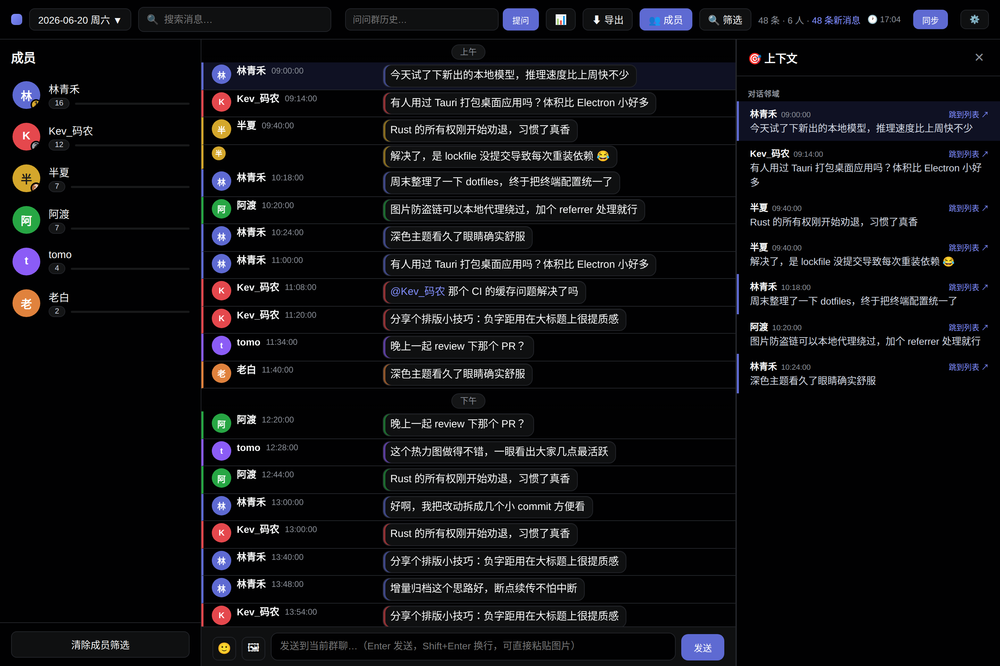
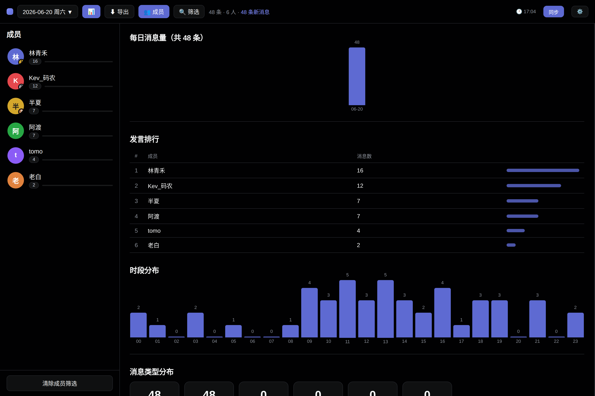

<p align="center">
  
</p>

<p align="center">
  
  
  
  <a href="https://github.com/alloevil/weibo-chat-auto/actions/workflows/ci.yml"></a>
  <a href="https://github.com/alloevil/weibo-chat-auto/releases/latest"></a>
  
  
  
</p>

<p align="center">
  <a href="README.md">English</a> | 简体中文
</p>

<p align="center">
  <a href="#-快速开始">快速开始</a> ·
  <a href="#-功能">功能</a> ·
  <a href="#-ai-功能">AI 功能</a> ·
  <a href="#-预览截图">截图</a>
</p>

---

自动归档微博网页聊天群的历史消息 — **原生桌面应用**（应用内扫码登录，无需手动配 Cookie）或本地查看器，支持多群、定时归档、按天导出，内置 AI 每日摘要与 Agentic 问答。

---

## 🎬 演示



> 演示中的用户名、群名与头像均为脱敏示例。

---

## ✨ 功能

| 归档 | 查看器 |
| --- | --- |
| 🗂 多群支持（`config.json` 配置） | ⚡ 实时同步（可开关，默认关闭）：新消息自动出现 |
| 🖥 原生桌面应用（应用内扫码登录） | 💬 **群内发言**：文字 / 表情 / 图片 |
| 🍪 Cookie 自动保持登录 + 会话保活 | 🎨 可切换皮肤：Linear 深色 / QQ 2000 / 2008 / 2012 |
| 📡 API 分页拉取全部历史 | 🔀 多群切换 + 📅 日历选择 |
| ➕ 增量归档（断点续传） | 🔍 当天就地高亮 + 跨全部日期检索 |
| 📆 按日期导出 JSON | 📊 统计面板（日活 / 排行 / 时段 / 词频） |
| ⏰ 定时任务 + 手动 Sync Now | 🧹 红包 / 噪声消息过滤 |
| | 🎯 上下文聚焦面板（追一条消息的来龙去脉） |
| | 💬 引用可跳转、标注原作者；@提及高亮 |
| | 🤖 AI 每日摘要 + Agentic Q&A 问答 |
| | 🖼 图片代理（绕过防盗链）、视频链接、分享卡片 |
| | 🔔 桌面通知（提到我 / 关键词）+ `@我` 筛选 |

---

## 🚀 快速开始

```bash
git clone https://github.com/alloevil/weibo-chat-auto.git
cd weibo-chat-auto
```

| 方式 | 命令 | 说明 |
|------|------|------|
| **桌面应用** | `npm run desktop` | 原生 app，应用内扫码登录，无需手动配 Cookie |
| **网页版** | `npm run setup` | 浏览器查看器 http://localhost:3456 |

首次运行会自动安装所需依赖（Rust/Bun/npm）。

### 🖥 桌面应用（macOS）

```bash
npm run desktop
```

一条命令完成：检测环境 → 安装依赖 → 编译 → 启动。打开后点击 🔑 登录，扫码即可开始归档。

### 🌐 网页版

```bash
npm run setup         # 首次：安装 + 配置 + 扫码登录
npm run view          # 之后：启动查看器
```

<details>
<summary><b>桌面应用架构</b></summary>

- **Tauri v2** 原生窗口 + WKWebView
- **Sidecar**：Bun 编译 `scripts/viewer-server.js` 为 ~60MB 独立二进制，app 启动时自动拉起
- **登录**：Rust 打开 WebView → 扫码 → `cookies_for_url()` 提取 HttpOnly Cookie → 自动保存
- **IPC**：WKWebView 不注入 Tauri IPC，改用 HTTP 信号中转
- **图片**：微博 CDN 检查 Referer，本地 `/api/sinaimg?url=` 代理绕过

</details>

<details>
<summary><b>手动安装（分步说明）</b></summary>

#### 1️⃣ 安装依赖

```bash
npm install
```

#### 2️⃣ 保存 Cookie

```bash
npm run save-cookies
```

会弹出一个**独立浏览器窗口**（与日常 Chrome 隔离），打开微博聊天页：用微博 App 扫码 → 手机确认 → 跳转到聊天列表后 Cookie 自动写入 `cookies.json`。

#### 3️⃣ 配置群聊

复制模板并填入群名（须与微博中**完全一致**）：

```bash
cp config.example.json config.json
```

```json
{
    "chromePath": "",
    "groups": ["群名称A", "群名称B"]
}
```

> `chromePath` 留空即自动探测系统中的 Chrome；仅在 Chrome 装在非默认位置时才需手动填写。

#### 4️⃣ 运行 & 查看

```bash
npm run archive   # 首次拉取最近 7 天，之后增量更新
npm run view      # 启动查看器 → http://localhost:3456
```

> 3456 端口被占用？用 `WEIBO_PORT=4000 npm run view` 换一个。

</details>

---

## 🔁 日常使用

平时保持查看器开着即可：

```bash
npm run view
```

打开 http://localhost:3456 → 点 **Sync Now** 同步最新消息（页面每 60s 自动刷新）。

<details>
<summary><b>读记录小技巧</b></summary>

- **🎯 上下文**：每条消息头部的链接，点开右侧面板看它的来龙去脉（被回复的原消息 + 前后邻域 + 后续回复）
- **引用跳转**：引用气泡标出原作者，点击可跳到原消息并高亮
- **搜索定位**：输入即在当天就地高亮（不隐藏其它消息，`n` / `N` 跳转）；同时跨**全部日期**检索，命中提示可展开结果面板，点一行直接跳到那天并高亮
- **@我**：导航栏 `@我` 只留提到你的消息。签到机器人会 @ 每个成员（实测占命中的 93%），已无条件排除
- **未读分隔线**：再次打开时，「以下为新消息」标出上次离开后的增量

</details>

<details>
<summary><b>Cookie 维护</b></summary>

微博把 webim 登录态和 weibo.com 侧的 **24 小时滚动会话**绑在一起：光有 SUB（名义有效期一年）不够，滚动会话断供一天就会失效。归档器与查看器内置了**自动保活**：

| 机制 | 说明 |
| --- | --- |
| 🫀 查看器保活 | 查看器运行期间每 30 分钟自动续期滚动会话（先验登录态，未登录绝不吸收游客 Cookie） |
| ✅ 每轮归档续期 | 归档成功后整包保存浏览器 Cookie，并顺手续期滚动会话 |
| ⚠ 失效横幅 | 会话失效时查看器顶部第一时间出现红色横幅，点击即弹扫码窗口 |
| 🔄 `npm run save-cookies` | 已过期时重新扫码（不影响已归档数据） |

因此：**保持查看器（或桌面 App）常驻，登录态基本不会过期**。彻底停用超过一天，或微博侧强制失效（换设备、改密码、风控）后，仍需重新扫码 —— 点 Sync 会自动弹出扫码窗口。

Cookie 失效时归档器会**明确报错并以退出码 1 退出**，提示去跑 `npm run save-cookies`；它不会假装成功。定时任务的日志在 `logs/archive.log`，出现 `Cookie 已失效` 即需扫码：

```bash
grep -c "Cookie 已失效" logs/archive.log   # 非 0 说明该重新扫码了
```

</details>

<details>
<summary><b>实时同步与发言</b></summary>

实时同步**默认关闭**，导航栏的「实时」下拉可开启。开启后出现绿色 **实时** 指示灯：服务端每 20 秒拉一次新消息，并入日文件后通过 SSE 推给页面，新消息自动出现 —— 不用点 Sync Now（那仍是"补全历史"用的全量归档）。消息区底部的输入框可直接发言（Enter 发送，Shift+Enter 换行）。

**为什么默认关闭**：轮询要调 `query_messages` 读群消息，而"读取是否会推进微博侧的已读游标"无法从外部证伪 —— 该接口的响应自带 `last_read_mid`，只能通过同一个接口观察它。若真会推进，原生微博客户端的未读提示就会被悄悄吃掉。证据倾向于不会（webim 客户端另有独立的 `clear_unread.json`，点开会话时才调用），但这个代价必须由你显式选择承担。

关闭时的保证是**一个请求都不发**：不起定时器、页面连 SSE 都不建立，连发送成功后的那次"催一轮同步"也跳过（此时自己发的消息等下次归档出现）。开关存在服务端（`live-config.json`），浏览器版与桌面版共享，切换立即生效、无需重启。

实时同步与发言都依赖**群会话 id**。归档器点击切群时会解析它并写进 `state/last-archive-state_<群名>.json`，所以：

| 状态 | 表现 |
| --- | --- |
| 已跑过归档（v1.15.0 之后） | 实时同步与发言均可用 |
| 还没跑过 | 该群输入框隐藏并提示"先点 Sync Now"；实时同步自动跳过该群 |

另外两个取舍：

- **没人看时不轮询**：页面全部关闭后轮询立即停止，不在后台空打微博接口。
- **自己发的消息不做本地回显**：发送成功后催一轮实时同步，自己的消息与别人的消息走完全相同的入库路径，避免两条来源的数据打架。
- **桌面通知**：默认只在**提到你**时弹（点击跳到那条消息）。设置里可加关键词订阅，或打开"每轮新消息都汇总通知"（一轮最多弹 3 条）。规则在服务端判定（`lib/notify-rules.js`），噪声不通知 —— 否则 93% 的推送都是签到机器人。授权只在真开了某条规则时才请求。
- **表情与图片**：输入框左侧可选表情（复用渲染用的 340 条官方清单，插入 `[标签]`），也能发图 —— 选择、粘贴均可，上限 20MB。

> 发图的上传端点（`/webim/uploadx.json`）是从 webim 前端 bundle 逆向出来的，**尚未对真实接口验证过**（真发一张就撤不回）。若发图失败，先看 `logs/` 里 `[send]` 那行的返回。

⚠️ 发消息是写操作，而查看器的 API 无鉴权（只绑 `127.0.0.1`）—— 本机任何程序都能借它发言。不要把端口暴露到外网。

</details>

---

## 🤖 AI 功能

查看器内置两个 AI 功能：**每日摘要** 和 **Agentic Q&A 问答**。需配置 OpenAI 兼容的 API。

### 配置

页面右上角 ⚙️ → 填写：

| 字段 | 说明 |
|------|------|
| Base URL | API 地址（如 `https://api.deepseek.com/v1`） |
| API Key | 密钥 |
| Model | 模型名（如 `deepseek-chat`） |
| Vision | 摘要时是否分析图片 |

配置保存到本地 `ai-config.json`（不会提交到 git）。

### Q&A 问答

在工具栏的问答输入框中提问，支持自然语言时间（"最近"、"昨天"、"上周"）和人名筛选。

**Agent 模式**（默认）：LLM 迭代搜索，自主决定关键词和搜索范围，多轮查找直到信息充分。

<details>
<summary><b>技术方案</b></summary>

采用 Agentic Search 模式，loop 机制参考：
- [Hermes Agent](https://github.com/NousResearch/hermes-agent) — IterationBudget + grace call
- [Pi-Multi-Agent](https://github.com/jwangkun/Pi-Multi-Agent) — state machine + retry with backoff + timeout
- LedgerAgent 论文 — 结构化状态累积

详见 [`docs/agent-qa.md`](docs/agent-qa.md)

**Benchmark (Agent vs Legacy):**

| 指标 | Agent | Legacy |
|------|-------|--------|
| 平均延迟 | 20.5s | 10.1s |
| 成功率 | 100% | 100% |
| 日期推理 | 正确 | 偶尔错误 |
| 搜索覆盖 | 多轮扩展 | 单次 |
| 答案质量 | 高 | 中 |

</details>

---

## 📸 预览截图

<details>
<summary><b>点击展开截图</b></summary>

**消息视图** — 时段热力图、引用气泡（标原作者）、@提及高亮、每条「🎯 上下文」入口



**上下文聚焦** — 点 🎯 弹出右侧面板：被回复的原消息 + 前后邻域 + 后续回复



**统计面板** — 每日消息量、活跃用户排行



> 截图中的用户名、群名与头像均为脱敏示例。

</details>

---

<details>
<summary><b>✅ 前置要求</b></summary>

| 必需 | 说明 |
| --- | --- |
| 🖥 **macOS / Linux / WSL** | 归档与查看器跨平台运行；定时任务全平台自动安装（launchd / systemd / cron） |
| 🟢 **Node.js 18+** | [brew install node](https://brew.sh)（macOS）/ `apt install nodejs`（Linux）/ [nodejs.org](https://nodejs.org) |
| 🌐 **Google Chrome** | 归档器用它登录并抓取消息；路径自动探测 |
| 📱 **微博账号 + 手机 App** | 首次需用 App 扫码登录网页版 |
| 🦀 **Rust + Bun** | 仅桌面应用需要；`npm run desktop` 会自动安装 |

> Windows 用户请在 [WSL](https://learn.microsoft.com/windows/wsl/install) 中使用；桌面应用目前仅在 macOS 验证。

</details>

<details>
<summary><b>⏰ 定时自动运行</b></summary>

**全平台** — `npm run setup` 安装时会询问是否启用，也可随时用一条命令管理（macOS 用 launchd，Linux 用 systemd user timer，无 systemd 的环境 —— 如部分 WSL 发行版 —— 回退写 crontab 条目）：

```bash
./scripts/schedule.sh install     # 安装（每小时归档一次）
./scripts/schedule.sh status      # 查看状态
./scripts/schedule.sh uninstall   # 干净卸载
```

systemd Linux 上可用 `systemctl --user list-timers weibo-archive.timer` 看到定时器。若自动安装失败，也可手动配置 cron（`crontab -e`），每小时归档一次：

```bash
0 * * * * cd /path/to/weibo-chat-auto && node scripts/auto-archive-simple.js >> logs/archive.log 2>&1
```

> 启用后定时归档会顺带刷新 Cookie，基本不会过期。

</details>

<details>
<summary><b>📁 项目结构</b></summary>

```text
weibo-chat-auto/
├── scripts/
│   ├── setup.sh                 # 网页版一键安装脚本
│   ├── run-desktop.sh           # 桌面应用一键启动（装依赖→编译→运行）
│   ├── auto-archive-simple.js   # 主归档脚本
│   ├── save-cookies.js          # Cookie 保存工具
│   ├── viewer-server.js         # 本地查看器服务器
│   ├── qa-agent.mjs             # Agentic Q&A 模块
│   └── …                        # 其他辅助脚本（QA 索引构建、渲染冒烟、截图）
├── config.example.json          # 群聊配置模板
├── config.json                  # 实际配置（不提交）
├── viewer.html                  # 查看器页面（单页应用，Linear 深色主题）
├── src-tauri/                   # Tauri v2 桌面应用（Rust）
│   ├── src/lib.rs               # 窗口、sidecar 拉起、应用内登录
│   └── tauri.conf.json
├── sidecar/build.mjs            # 用 Bun 把 viewer-server 编译为独立二进制
├── cookies.json                 # 登录凭据（不提交）
├── ai-config.json               # AI 配置（不提交）
├── state/                       # 归档状态（不提交）
├── output/                      # 归档数据（不提交）
│   └── 群名/
│       └── weibo_chat_2026-05-01.json
├── cache/images/                # 图片缓存（不提交）
├── docs/                        # 文档和截图
│   └── agent-qa.md              # Agent Q&A 技术方案
└── package.json
```

</details>

<details>
<summary><b>🧾 输出数据格式</b></summary>

每条消息：

```json
{
    "id": 123456789,
    "from_uid": 12345,
    "user": "用户名",
    "avatar": "https://...",
    "timestamp": 1778000000000,
    "time": "2026/05/11 12:00:00",
    "date": "2026-05-11",
    "content": "消息内容",
    "type": 321,
    "pics": ["https://upload.api.weibo.com/2/mss/msget?source=...&fid=..."],
    "share": {
        "url": "http://weibo.com/...",
        "title": "...",
        "author": "...",
        "pics": ["https://wx1.sinaimg.cn/large/..."],
        "reposts": 100,
        "comments": 50,
        "likes": 200
    }
}
```

</details>

---

## 🛠 故障排除

<details>
<summary><b>Cookie 失效</b>（同步报错、日历不更新、日志出现"未找到群聊"）</summary>

```bash
npm run save-cookies
```

扫码登录后 Cookie 自动保存。

**为什么过期？** 独立浏览器不共享日常登录态，微博的滚动会话断供约一天即失效。保持查看器常驻（内置 30 分钟保活）或定时任务运行可自动续期。
</details>

<details>
<summary><b>页面加载失败</b></summary>

检查 `config.json` 中的 `chromePath` 是否正确，并确认已安装 Google Chrome。
</details>

<details>
<summary><b>3456 端口被占用</b></summary>

查看器会输出一行提示并退出（最常见原因是桌面应用已在运行 —— 服务是同一个，直接打开 http://localhost:3456 即可）。想换端口运行：

```bash
WEIBO_PORT=4000 npm run view
```
</details>

<details>
<summary><b>图片不显示</b></summary>

图片经本地服务器代理加载（依赖有效 Cookie），Cookie 过期后无法显示。重新 `npm run save-cookies` 即可。
</details>

---

## 🔒 隐私声明

> **本工具仅供归档自己参与的群聊消息，请勿用于侵犯他人隐私。**

- 归档数据包含群内所有成员的消息内容、用户名和头像
- 请妥善保管 `cookies.json` 和 `output/`，切勿公开分享
- 代码仅供学习交流，使用者自行承担风险
- 请遵守微博服务条款和相关法律法规

---

## 📄 License

[MIT](LICENSE)

---

<p align="center">
  <sub>⭐ 觉得有用？给个 Star 吧！</sub>
</p>
