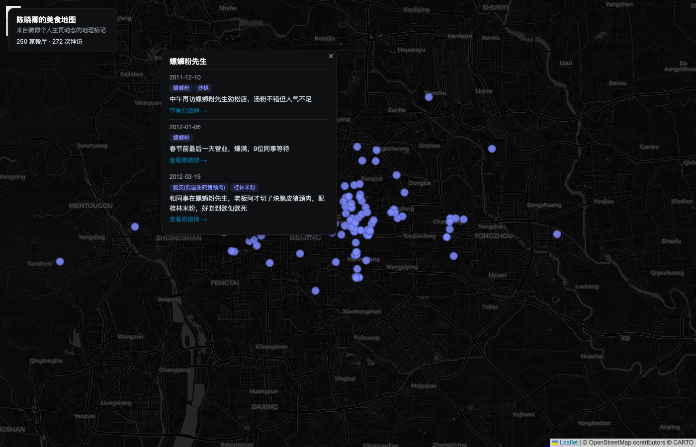

# 美食地图

抓取某个美食博主(微博个人主页)的历史动态,识别带地理位置标记的餐馆,用 AI 抽取推荐菜品,画成地图。



> 以陈晓卿(@陈晓卿)公开微博主页动态抓取、抽取生成,截图为真实数据(餐厅名/菜品/引用均来自其公开发布的内容)。

## 使用步骤

```bash
# 1. 登录 weibo.com 主站(与群聊归档的登录完全独立,各自一份 Cookie,见 weibo-cookies.mjs)
node foodmap/login.mjs

# 2. 确认博主的数字 UID(可用 profile/info 接口按昵称反查,避免同名账号抓错人)
#    也可以直接在浏览器打开博主主页,从 URL 里读 uid,如 weibo.com/u/1647375747

# 3. 先探测一下(只抓 1-2 页,不落盘,打印位置字段命中情况)
node foodmap/fetch-posts.mjs --uid <uid> --name <博主名> --probe

# 4. 正式抓取全部历史动态(增量续跑;首次建议 --mode full 保证从头拉全)
node foodmap/fetch-posts.mjs --uid <uid> --name <博主名> --mode full

# 5. 识别餐馆 + 抽取推荐菜品(会调用 ai-config.json 里配置的模型)
node foodmap/extract-restaurants.mjs --name <博主名>

# 6. 起地图页
node foodmap/server.mjs --name <博主名>
# 打开 http://localhost:3457/
```

## 已知限制

- 只收录微博官方"位置(geo)"或"签到卡片"标记过的动态,纯文字提到餐馆但没打位置标签的不会被收录。实测陈晓卿账号的命中率约 18%(1131/6129 条原创动态带位置信号)。
- 转发(retweet)动态一律跳过,因为位置信息属于被转发者,不代表博主本人的拜访。
- 餐厅去重按"名称完全一致"聚合,同一家店的名称写法不同(如"海天总部"和"佛山海天总部食堂")不会自动合并。
- 微博 `geo` 字段坐标顺序是 `[纬度, 经度]`,与标准 GeoJSON 相反,已在 `normalize.mjs` 里转成 `{lat, lng}` 消除歧义,不要在别处再假设顺序。

## 文件说明

| 文件 | 作用 |
|---|---|
| `weibo-cookies.mjs` | 独立于群聊功能的 Cookie 存取(**不要**与 `lib/cookie-store.js` 混用) |
| `login.mjs` | 扫码登录 weibo.com 主站 |
| `normalize.mjs` | 微博动态字段裁剪/归一(纯函数,见顶部注释里的实地探测结论) |
| `fetch-posts.mjs` | 抓取个人主页动态(CLI) |
| `extract.mjs` | 位置识别 + LLM 抽取 + 按餐厅聚合(纯函数) |
| `extract-restaurants.mjs` | 调用 extract.mjs 的 CLI |
| `index.html` / `server.mjs` | 地图展示页 + 最小静态/数据 server |
| `data/<博主名>/posts_raw.json` | 归一化后的原始动态(增量合并) |
| `data/<博主名>/restaurants.json` | 最终结构化餐厅数据,供地图页消费 |
